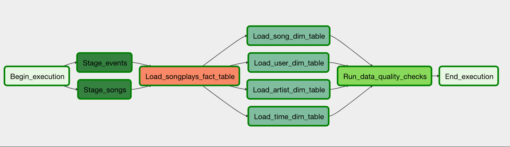
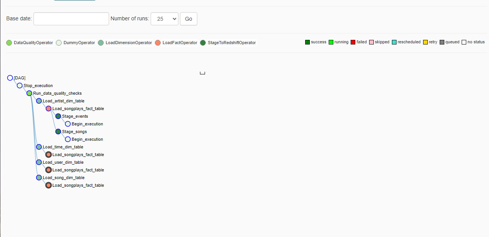

# Project 5 - Data Pipelines with Apache Airflow

## Project Summary

This project expands on Sparkify's existing data infrastructure through the introduction of scheduling and automation of ETL pipelines using Apache Airflow.

Raw data will be extracted from S3 buckets to staging tables in Redshift, where transformation and loading of the data into dimension tables will take place.

## Setup Instructions

1. Create an AWS Redshift cluster

2. Initialize Airflow by running the command '/opt/airflow/start.sh' in your terminal

3. In the Airflow UI create AWS and Redshift connections using your saved credentials

4. Run the DAG file 'udac_example_dag' to trigger the data pipeline

## Project Structure

|
|___ dags
|	|___ udac_example_dag.py				# DAG for the data pipeline
|
|___ images 							# contains images for README.md
|
|___ plugins
|	|___ helpers
|	|	|___ __init__.py
|	|	|___ sql_queries.py				# Contains SQL queries for selecting required data
|	|
|	|___ operators
|	|	|___ __init__.py
|	|	|___ data_quality.py				# Validates data quality in tables
|	|	|___ load_dimension.py				# Loads data from staging tables into dimension tables
|	|	|___ load_fact.py				# Loads dataa from staging tables into fact table
|	|	|___ stage_redshift.py				# Copies data from target S3 bucket into Redshift staging table
|
|___ README.md							# Documentation of project
|___ create_tables.sql						# Contains SQL queries to be used for building tables

The layout of task dependencies for this DAG can be seen below:

The tree view layout is also provided below:

#### DAG Parameters:
* No dependencies on past runs
* DAG schedule interval set to hourly
* On failure, tasks are retried 3 times
* Retries happen every 5 minutes
* Catchup is turned off
* Emails are not sent on retries
